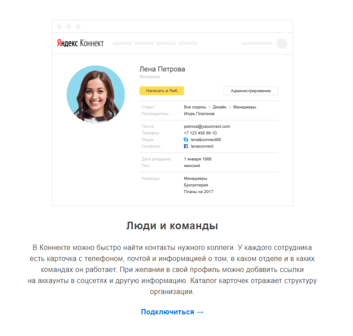

# CEO: Write-up

После таска __Глубина__ у нас был доступ к почте. Заметим, что почта хостится на Яндексе. С 2018 года постепенно на замену всем известной [Почте для домена](https://pdd.yandex.ru/) пришел [Яндекс.Коннект](https://connect.yandex.ru/) — набор сервисов для бизнеса.

Давайте узнаем, что же умеет этот, несомненно, полезный сервис.

На главной странице видим вот такую карточку:

Хм, похоже на то, что нам нужно. Быстро находим сайт [staff.yandex.ru](https://staff.yandex.ru/) (если залогинены в почту), видим структуру компании, ищем Президента Банка, открываем её Телеграм, орём с фоточек в профиле, получаем флаг.

Флаг: **uctf_i_kn0w_the_staff**
